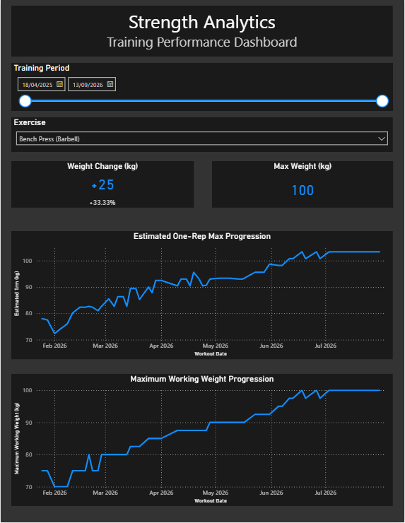

# Strength Progress Dashboard

An interactive Power BI dashboard built to analyse and visualise strength progression using my personal workout data exported from Hevy.

## Overview

The dashboard transforms raw workout data into an interactive report for tracking strength performance over time. Users can filter by exercise and date range to examine changes in performance across their training history.

## Current Dashboard

### Strength Progress

The first page focuses on strength progression and includes:

- Exercise and date filtering
- Maximum weight lifted
- Estimated one-rep max (1RM)
- Absolute and percentage changes in strength
- Strength progression over time
- Dynamic metrics that respond to the selected exercise and date range

## Data Preparation

Workout data was exported from Hevy in CSV format and transformed using Power Query. Data preparation included filtering unnecessary records and fields, handling warm-up and working sets, and preparing workout dates for analysis.

## Tools & Skills

- Power BI
- Power Query
- DAX
- Data cleaning and transformation
- Data visualisation
- Dashboard design

## Project Status

This project is currently being developed.

Planned additions include further analysis of training volume, muscle groups and exercise movement/joint actions.
